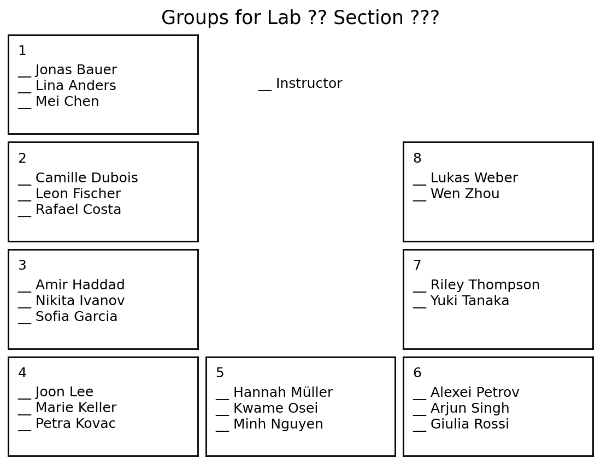

# Automatic sign-in sheets with groups for PHYS/BIOPHYS 251
This script draws a sign-in sheet showing what group/table students are
assigned to. For example:



## Usage
To use this script:
```
$ python draw_sheets.py -h
usage: draw_sheets.py [-h] [-v] [-f] [-e ext [ext ...]] [-l number]
                 [-s section [section ...]]

Draw a sign-in sheet showing what group/table students are assigned to.

options:
  -h, --help            show this help message and exit
  -v, --verbose         print status messages (default: False)
  -f, --force           pull recent CSV from Canvas (default: False)
  -e, --extensions ext [ext ...]
                        output formats (default: ['pdf', 'png'])
  -l, --lab number      -1 means next lab (default: -1)
  -s, --sections section [section ...]
                        your section numbers (default: [15, 25])

Files are organized in the current directory like this:
    .
    ├── draw_sheets.py
    └── lab01
        ├── canvas.csv
        ├── groups015.png
        └── groups025.png
```

## Setup
This script relies on a CSV file from Canvas that defines the groups.

### Manual download
For example, for Lab 1 navigate to People > Groups > Lab 1, which is
[here](https://umich.instructure.com/courses/850281/groups#tab-67168) and
select "Download Group Category Roster CSV" under the three dots at the top.

Save the file as `./lab01/canvas.csv` and simply run
```
$ python draw_sheets.py -v
```

### Automatic download
You can use the Canvas API to automatically download the CSV when needed. This
requires an access token (i.e. password) that you can generate under Account >
Settings > Approved Integrations > New Access Token.

Copy the token into
```
TOKEN = "<your_access_token_here>"
```

Now you can automatically download the next labs groups from Canvas using
```
$ python draw_sheets.py -v
```

### Dependencies
This scripts uses `python3` and requires `numpy` and `matplotlib`. It has only
been tested on Linux, but is expected to run on other platforms as well.

## Documentation
The Canvas API is well documented. The function
[group_categories.export](https://developerdocs.instructure.com/services/canvas/resources/group_categories#method.group_categories.export).
exports a CSV file formatted like
[this](https://developerdocs.instructure.com/services/canvas/group-categories/file.group_category_csv)
and needs the id of the group category. We can query all existing group
categories using
[group_categories](https://developerdocs.instructure.com/services/canvas/resources/group_categories#method.group_categories.index)
and find the one we need.

## Scheduling (optional)
If you aready added an access token for the API nothing stops you from
automatic this even more, by scheduling this script to run once a week (e.g. on
Monday mornings) so that the new sign-in sheets will be ready when you need it.

### Linux
#### systemd
To schedule this script to run once a week until it succeds once define a
[systemd timer](https://wiki.archlinux.org/title/Systemd/Timers)
like `canvas_groups.timer`in `/etc/systemd/system` or `~/.config/systemd/user`.
```
[Unit]
Description=Weekly trigger for PHYS/BIOPHYS 251 script

[Timer]
OnCalendar=Mon *-*-* 00:00:00
Persistent=true

[Install]
WantedBy=timers.target
```

It triggers a systemd service like `canvas_groups.service` in the same
directory.
```
[Unit]
Description=Create new sign-in sheets for PHYS/BIOPHYS 251
Wants=network-online.target
After=network-online.target

# Allow retries for up to a week
StartLimitIntervalSec=1week
StartLimitBurst=28

[Service]
Type=oneshot
WorkingDirectory=/path/to/your/directory
ExecStart=/path/to/your/directory/draw_sheets.py

# Retry logic
Restart=on-failure
RestartSec=6h
```

Load the new definitions with
```
$ systemctl --user daemon-reload
```

and start and enable the timer with
```
$ systemctl --user enable --now myscript.timer
```

#### cron
Alternatively, use [cron](https://wiki.archlinux.org/title/Cron) and define a
simple `crontab` file that runs the script once a week on Mondays at 12PM.
```
0 12 * * 1 /path/to/draw_sheets.py
```

Load it with
```
$ crontab /path/to/crontab
```

### Windows
I don't know how Windows works, usually it doesn't.

### MacOS
I don't have the money for that...

## TODOs
- show how to modify the table layout
- explain how to read course IDs, etc. from Canvas URLs
- document canvas functions in the source code
